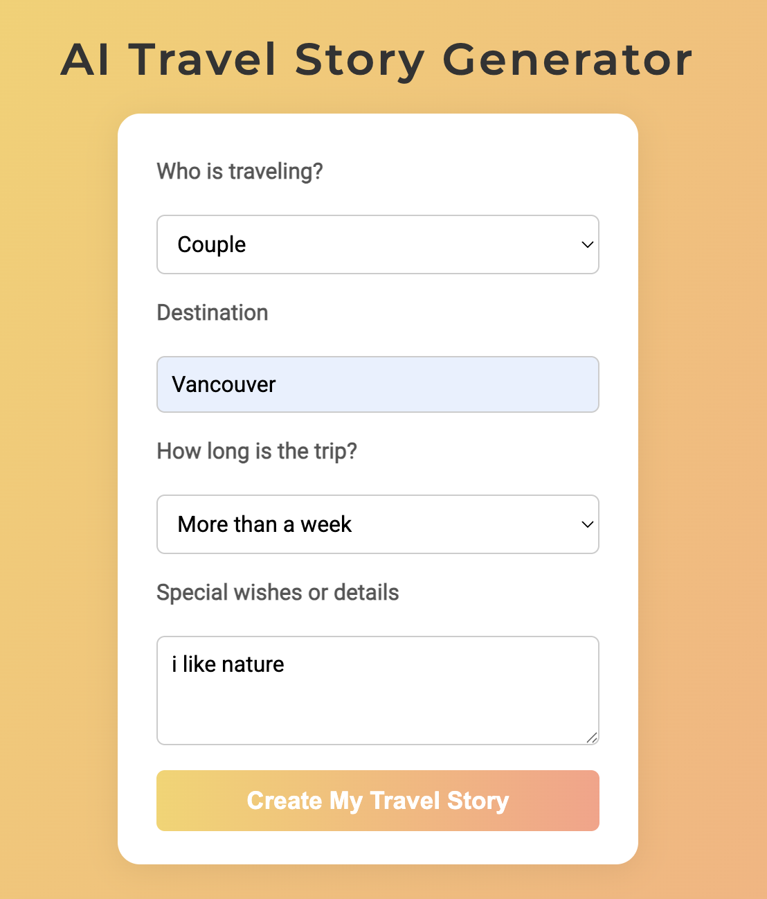
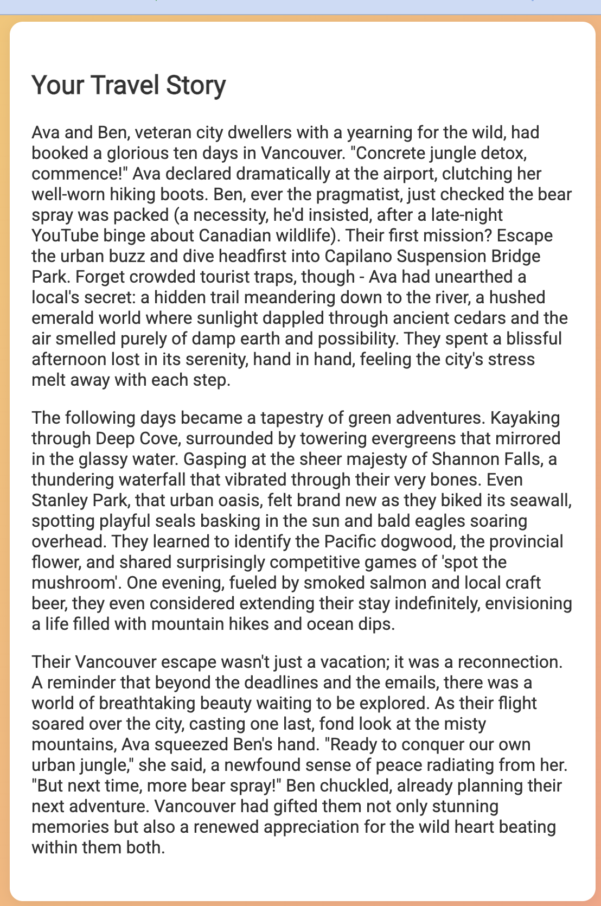

# AI Travel Story Generator

This project is an AI-powered web application that generates personalized travel stories based on user input. Users can specify who is traveling, the destination, trip duration, and any special wishes or details. The app then creates a unique travel story using AI.

## Features

- Simple and intuitive web interface
- Customizable travel story generation
- AI-generated, detailed, and engaging travel narratives

## Screenshots

### Input Form



### Generated Story



## How to Use

1. Open the web app in your browser.

2. Fill in the form:
	- **Who is traveling?** (e.g., Couple, Family, Solo)
	- **Destination** (e.g., Vancouver)
	- **How long is the trip?** (e.g., More than a week)
	- **Special wishes or details** (e.g., I like nature)

3. Click the **Create My Travel Story** button.

4. Your personalized travel story will appear below the form.

## How to Run the App

### Prerequisites

- Python 3.8+
- Node.js (for frontend, if using a local server)

### Backend

1. Create and activate a virtual environment (if not already):

	```sh
	python3 -m venv .venv
	source .venv/bin/activate
	```

2. Navigate to the `backend` directory:

	```sh
	cd backend
	```

3. Install dependencies:

	```sh
	pip install -r requirements.txt
	```

4. Set up Gemini API key.
    ``` sh
    touch .env
    ```
    add key information in .env `GEMINI_API_KEY=get_from_google_ai_stadio`
    [https://aistudio.google.com/apikey](https://aistudio.google.com/apikey)

5. Run the backend server (from the `backend` directory):

	```sh
	../.venv/bin/uvicorn main:app --host 0.0.0.0 --port 8000
	```

### Frontend

1. Navigate to the `frontend` directory:

	```sh
	cd ../frontend
	```

2. Start a local server and open in your browser:

	```sh
	python3 -m http.server 3000
	# Then open http://localhost:3000 in your browser
	```

## Project Structure

```text
20250829-ai-powered-story/
├── backend/
│   ├── main.py
│   └── requirements.txt
├── frontend/
│   ├── index.html
│   └── index.js
├── images/
│   ├── ai-travel-story-generator-form.png
│   └── ai-travel-story-generator-story.png
└── README.md
```

## Notes

- The backend uses a Python virtual environment (`.venv`) for dependency management.  
	Always activate the virtual environment before running or installing packages.
- The frontend is started with `python3 -m http.server 3000` and the backend with `../.venv/bin/uvicorn main:app --host 0.0.0.0 --port 8000`.

## License

MIT
